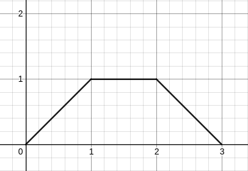
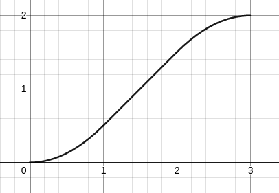
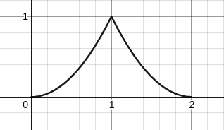

# rubato

- [But why though?](#b-w-t)
- [Arguments and Methods](#a-and-m)
- [Custom Easing Functions](#c-e-f)
- [Installation](#install)
- [Why the name?](#name)
- [Todo](#todo)

Basically like [awestore](https://github.com/K4rakara/awestore) but not really.

Join the cool curve crew

![imagine not having a cool slope curve][https://cdn.discordapp.com/attachments/702548961780826212/879022533314216007/download.jpeg]

The general premise of this is that I don't understand how awestore works. That
and I really wanted to be able to have an interpolator that didn't have a set
time. That being said, I haven't made an interpolator that doesn't have a set
time yet, so I just have this instead. It has a similar function to awestore but
the method in which you actually go about doing the easing is very different.

In this case, you essentially construct a graph of the slope you want for
easing. The reason for that is, if you are working with the derivative the whole
time, you can make transitions between slopes (basically interruptions of the
animation) completely smooth. The only things you really need to supply are the
duration of the animation, the duration of the intro, and the easing function,
but much more is configurable.

Essentially, it takes a curve like this



and turns it into its antiderivative, which looks something like this



which is just the antiderivative, and is beautifully eased. The length of the 
`y=±x` varies based off of the intro duration and the exact function used
depends on the easing you give it. The maximum height of the function is
generated on the fly via this wonderful formula:


where `i` is intro duration, `F_i` is the antiderivative of the intro easing
function, `o` is outro duration, `F_o` is the antiderivative of the outro easing
function, `d` is the total distance needed to be traveled, `b` is the initial
slope, and `t` is the total duration. How does this formula work? Magic (if
you're actually interested, for some ungodly reason feel free to ask). How did I
find it? Also magic (hours of staring at xournal++ and debugging).

Okay so this is what it looks like in action

```lua
--what I actually use for my workspaces
timed = rubato.timed {
	intro = 0.1,
	duration = 0.3
}
```


This is very subtly eased, however. A much more pronounced easing would look
more like this:

```lua
timed = rubato.timed {
	intro = 0.5,
	duration = 1,
	easing = rubato.quadratic --quadratic slope, not easing
}
```


The first is the same trapezoid I had shown earlier, except the distance is
different. The second's slope curve looks more like the one shown below. Not the
lack of a plateau which gives the more pronounced easing:



<h1 id="b-w-t">But why though?</h1>

Why go through all this hastle? Why not just use awestore? That's a good
question and to be fair you can use whatever interpolator you so choose.
However, rubato does have one advantage, which is that interruptions
are as perfect as can be. It conserves the current position and slope of the
previous animation when you start a new one, and even allows you to use a custom
specific easing animation for interruptions. Basically the interruptions are
mathematically as smooth as you can possibly make them. Kinda.

Furthermore, if you use rubato, you get to brag about how annoying it
was to set up a monstrous derivative just to write a custom easing function,
like the one shown in [Custom Easing Function](#c-e-f)'s example. That's a
benefit, not a downside, I promise.

Also maybe hopefully the code should be almost digestible kinda maybe. I tried
my best to comment and documentate, but I actually have no idea how to do lua
docs or luarocks or anything.

Also it has a cooler name

<h1 id="a-and-m">Arguments and Methods</h1>

**For rubato.timed**:

Arguments come in the form of a table.
 - `duration`: the total duration of the animation
 - `rate`: the number of times per second the timer executes. Higher rates mean
   smoother animations and less error.
 - `pos`: the initial position of the animation (def. `0`)
 - `intro`: the duration of the intro
 - `outro`: the duration of the outro (def. same as `intro`*)
 - `inter`: the duration of the between-animation time (def. same as `intro`)
 - `prop_intro`: When `true`, `intro`, `outro` and `inter` represent proportional
   values; 0.5 would be half the duration. (def. `false`)
 - `easing`: the easing table (def. `interpolate.linear`)
 - `easing_outro`: the outro easing table (def. same as `easing`)
 - `easing_inter`: the "intermittent" easing function, which defines which
   easing to use in the case of animation interruptions (def. same as
   `easing`)
 - `subscribed`: a function to subscribe at initialization (def. `nil`)
 - `override_simulate`: when `true`, will simulate everything instead of just
   when `dx` and `b` have opposite signs at the cost of having to do a little
   more work (and making my hard work on finding the formula for `m` worthless 
   :slightly_frowning_face:) (def. `false`)
 - `awestore_compat`: Make api even *more* similar to awestore's

*with the caviat that if the outro being the same as the intro would result in
an error, it would go for the largest allowable outro time. Ex: duration = 1,
intro = 0.6, then outro will default to 0.4.

Methods are as follows:
 - `timed:set(target_new)`: sets the position the animation should go to
 - `timed:subscribe(func)`: subscribe a function to be ran every refresh of the
   animation
 - `timed:unsubscribe(func)`: unsubscribe a function
 - `timed:abort()`: stop the animation
 - `timed:is_started()`: returns `true` if the animation is started, `false` otherwise
 - `timed:update_rate(rate_new)`: updates the rate along with an internal number. If
   you want to update rate dynamically you should use this function


**builtin easing functions**
 - `rubato.zero`: linear easing, zero slope
 - `rubato.linear`: linear slope, quadratic easing
 - `rubato.quadratic`: quadratic slope, cubic easing
 - `rubato.bouncy`: the bouncy thing as shown in the example

<h1 id="c-e-f">Custom Easing Functions</h1>

To make a custom easing function, it's pretty easy. You just need a table with
two values:

 - `easing`, which is the function of the slope curve you want. So if you want
   quadratic easing you'd take the derivative, which would result in linear
   easing. **Important:** `f(0)=0` and `f(1)=1` must be true for it to look
   nice.
 - `F`, which is basically just the value of the antiderivative of the easing
   function at `x=1`. This is the antiderivative of the scaled function (such
   that (0, 0) and (1, 1) are in the function), however, so be wary of that.

In practice, creating your own easing would look like this:

1. Go to [easings.net](https://easings.net)

For the sake of this tutorial, we'll do an extremely complex easing, "ease in
elastic"  

2. Find the necessary information

**Important:** You should really use sagemath or Wolfram Mathematica to get as
exact of a derivative as you can. Wolfram Alpha doesn't cut it. I personally
used sagemath because it's actually free, which is pretty cool. To take that
one step further, I'd suggest using jupyter notebook in tandem with sagemath
because if you do `%display latex` you get a super good looking output. If you
can't use jupyter (or don't want to), `%display ascii_art` is a pretty cool
alternative.

The initial function, given by [easings.net](https://easings.net), is as follows:  


The derivative (via sagemath) is as follows:  


First we double check that `f'(0)=0`, which in this case it is not.  


so now we subtract `f'(0)` from `f'(x)` and get a pretty messy function, let's
say `f_2(x)`. Regrettably, we're about to mess up that function a little more.
Next we check that `f_2(1)=1`. In this case, once again, it doesn't. We get  


So now we divide our `f(x)` by `f(1)`, to get our final function, `f_e(x)` (easing function) (I am so great at naming these kinds of things)  


Great... This is going to be a treat to write as lua... Anyways, our final step is to
find the definite integral from 0 to 1 of our `f(x)`, which is this  


Now I'm sure that looks pretty daunting. However, these functions are kinda
stupidly easy to find with sagemath. You basically only have to run these
commands:

```python
from sage.symbolic.integration.integral import definite_integral
function('f')
f(x)=factor(derivative('''your function goes here''', x))
f(x)=factor(f(x)-f(0))
f(x)=factor(f(x)/f(1))
print(f(x)) # easing
print(definite_integral(f(x), x, 0, 1)) # F
```

which will tell you all you need to know.

It's important to use the `factor(...)` thing because otherwise you may end up
with decimals, which really should be avoided if possible. When I didn't do
factor, there were 0.499999s which makes it decently less accurate and
substantially more complicated.

4. Now we just have to translate this into an actual lua table. You might want
   to be careful about not doing more operations than necessary but honestly it
   probably doesn't much matter.

```lua
--all the constants are calculated only once
local cs = {
	c1 = 6 * math.pi - 3 * math.sqrt(3) * math.log(2),
	c2 = math.sqrt(3) * math.pi,
	c3 = 6 * math.sqrt(3) * math.log(2),
	c4 = 6 * math.pi - 6147 * math.sqrt(3) * math.log(2),
	c5 = 46 * math.pi / 6
}

bouncy = {
	F = (20 * math.pi - (10 * math.log(2) - 2049) * math.sqrt(3)) / 
		(20 * math.pi - 20490 * math.sqrt(3) * math.log(2)),
	easing = function(t)
		--short circuit
		if t == 0 then return 0 end
		if t == 1 then return 1 end

		--both of these values are reused
		local c1 = (20 * t * math.pi) / 3 - cs.c5
		local c2 = math.pow(2, 10 * t + 1) --in the 2^{10x+2} I factored out the 2 to calculate this once
		return (cs.c1 + cs.c2 * c2 * math.cos(c1) + cs.c3 * c2 * math.sin(c1)) / cs.c4
	end
}

timed = rubato.timed {
	intro = 0, --we'll use this as an outro, since it's weird as an intro
	outro = 0.7,
	duration = 1,
	easing = bouncy
}
```

We did it! Now to check whether or not it actually works


While you can't see its full glory in 25 fps gif form, it really is pretty cool.
Furthermore, if it works with *that* function, it'll probably work with
anything. As long as you have the correct antiderivative and it's properly
scaled, you can probably use any (real, differentiable) function under the sun.

Note that if it's not properly scaled, this can be worked around (if you're lazy
and don't care about a minor performance decrease). You can set
`override_simulaton` to true. However, it is possible that it will not perform
exactly as you expected if you do this so do your best to just find the
derivative and antiderivative of the derivative.

<h1 id="install">Installation</h1>

So actually telling people how to install this is important, isn't it

basically, just somewhere in your awesome directory, (I use `~/.config/awesome/lib`) run this command:  
`wget https://raw.githubusercontent.com/andOrlando/rubato/main/rubato.lua`

Then, whenever you actually want to use rubato, do this at the start of the lua file  
`local rubato = require "lib.rubato"`

<h1 id="name">Why the name?</h1>

Beacuse I play piano so this kinda links up with other stuff I do, and rubato
really well fits the project. In music, it means "push and pull of tempo"
basically, which really is waht easing is all about in the first place. Plus,
it'll be the first of my projects without garbage names ("minesweperSweeper,"
"Latin Learning").

<h1 id="todo">Todo</h1>

 - [ ] add `target` function, which rather than a set time has a set distance.
 - [x] improve intro and outro arguments (asserts, default values, proportional intros/outros)
 - [x] get a better name... (I have a cool name now!)
 - [x] make readme cooler
 - [ ] have better documentation and add to luarocks
 - [ ] remove gears dependancy

